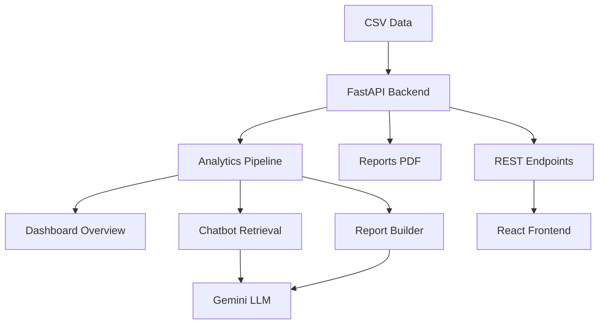

# GenAI Employee Analytics

GenAI Employee Analytics is a full-stack analytics platform for workforce performance, retention, compensation, training, hiring, and project intelligence. It ships with a FastAPI backend, a React + Tailwind frontend, a Gemini-powered insight layer, and a Reports Center that generates professional PDF summaries.

## Highlights

- Executive dashboard overview with KPI tiles and charts
- AI chatbot for natural-language analytics queries
- Report Center with on-demand PDF generation (charts + AI insights)
- Responsive UI built with React, Tailwind CSS, and Recharts
- Backend analytics pipeline with cached dataframes

## Architecture




If you want a custom diagram (SVG/PNG), add it to the repo (for example, `docs/architecture.svg`) and link it in the README.

## Project Structure

```
backend/
	app.py
	services/
		analytics.py
		chatbot_service.py
		llm_service.py
		report_service.py
	data/
frontend/
	src/
		App.js
		HomePage.js
		ReportsPage.js
		ChatbotPage.js
```

## Backend Setup

1. Create a virtual environment and install dependencies:

```
pip install -r backend/requirements.txt
```

2. Install PDF/report dependencies:

```
pip install reportlab matplotlib
```

3. Set environment variables (required for AI insights):

```
GEMINI_API_KEY=your_key_here
GEMINI_MODEL=gemini-2.5-flash
```

4. Run the API:

```
uvicorn app:app --reload --app-dir backend
```

Backend runs at http://localhost:8000.

## Frontend Setup

1. Install dependencies:

```
cd frontend
npm install
```

2. Run the app:

```
npm start
```

Frontend runs at http://localhost:3000 and calls the backend at http://localhost:8000.

## Key Pages

- `/` Home dashboard overview
- `/dashboard` AI insights dashboard
- `/chatbot` Conversational analytics
- `/reports` Reports Center

## API Endpoints (Core)

Base URL: http://localhost:8000

### Health and overview

- `GET /health`
- `GET /basic-stats`
- `GET /dashboard-overview`

### Chatbot

- `POST /chatbot/query`

### Reports (PDF)

- `GET /reports/performance`
- `GET /reports/attrition`
- `GET /reports/compensation`
- `GET /reports/training`
- `GET /reports/behavioral`
- `GET /reports/project`
- `GET /reports/hiring`
- `GET /reports/executive-summary`
- `GET /reports/{report_key}`

### AI Insights (Selected)

- `GET /insights/performance`
- `GET /insights/attrition`
- `GET /insights/compensation`
- `GET /insights/training`
- `GET /insights/soft-skills`
- `GET /insights/project`
- `GET /insights/hiring`

## Notes

- Reports are generated on demand and returned as downloadable PDFs.
- Gemini errors are handled with user-friendly fallback messages.
- The backend caches processed dataframes for faster queries.
